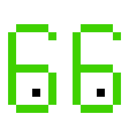

    

# CraftyEyeballs

It's been more than ten years since the world has run out of IPv4 addresses and internet providers are finally starting
to offer full IPv6. While the transition is progressing painfully slowly, progress is being made and more and more
services are reachable over just IPv6 every day. Minecraft servers, however, are still stuck on IPv4.

The main reason for this is that [Mojang's IPv6 implementation is broken](https://bugs.mojang.com/browse/MC-255735).
Normally, when a service is reachable over IPv4 and IPv6 (dual-stack), the client will try to connect to both addresses
and use the first one that responds (preferring IPv6). However, Minecraft's client will only try to connect to the first
address it can find, which is usually the IPv4 address. This means that if a server is reachable over both IPv4 and
IPv6, the client will always connect over IPv4, even when only IPv6 is available. CraftyEyeballs solves this problem!

CraftyEyeballs is a mod that changes the way the Minecraft client connects to servers to
the [Happy Eyeballs algorithm](https://en.wikipedia.org/wiki/Happy_Eyeballs). This means that the client will now try
to connect to both IPv4 and IPv6 addresses and use the first one that responds. This way, the client will prefer IPv6
over IPv4 when both are available, allowing servers to gradually transition to IPv6 without losing their IPv4 clients or
having to set up a separate hostname for IPv6-only players to connect to.

This mod is client-side only. It will do nothing on a server.

## Frequently Asked Questions

### What are the advantages for server owners?

Providers with a small amount of IPv4 address space will be forced to use NAT to allow multiple users to share a single
IPv4 address. This can cause multiple people, even in separate households, to share the same public IPv4 address. When
moderating for ban evasion and the usage of alternate accounts, this can cause issues. With IPv6, every end user
(household) gets its own subnet, preventing the issues shared IPs can bring.

### But almost no servers support IPv6!

That is true, but it's also a bit of a chicken-and-egg problem. Servers don't bother implementing IPv6 because Mojang's
implementation prefers IPV4. If more clients start using a proper IPv6 implementation, servers will have more incentive
to support it.

### What happens when this mod is installed, but I don't have IPv6?

If your computer has no (or broken) IPv6 connectivity, the connection via IPv4 will be preferred since it connects the
quickest (since the IPv6 connection never connects).

### Can I include this mod in my modpack?

Yes!
